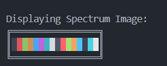

# RLE Image Encoder

An Image Encoder that reads hex strings and displays them in an image format. 

## Features

Displays a Spectrum Image of colors to see the current scheme (based on theme):

RLE Menu with options to load, read, and display images based on hex strings:

RLE Menu
--------
0. Exit
1. Load File
2. Load Test Image
3. Read RLE String
4. Read RLE Hex String
5. Read Data Hex String
6. Display Image
7. Display RLE String
8. Display Hex RLE Data
9. Display Hex Flat Data
Select a Menu Option:

Displaying custom hex strings are a *work in progress*. They will be updated as I complete other parts of the lab.
